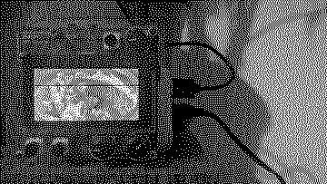
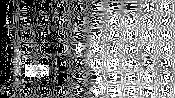

# Scanline

Computer music.

<kbd>K1</kbd> change scene. <kbd>E2</kbd> change line. <kbd>E3</kbd> change rate, <kbd>K1</kbd>E3</kbd> do it with higher resolution. Crow <kbd>input1</kbd>

Place 128x64 pixel PNG images in `lib/`.

